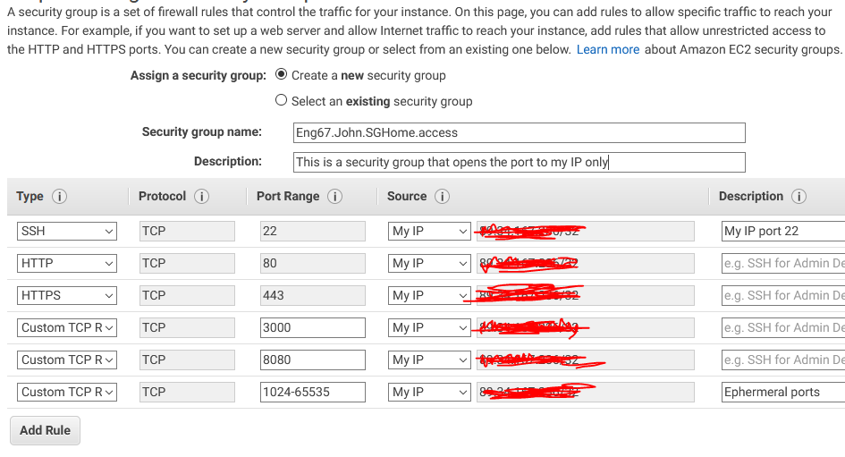

# Setting up the Second EM2 Machine on AWS

For the first task we have been asked to set up a second EM2 Machine on **AWS** following the same process we followed to create the Machine that is currently holding our webserver.

So to set this up I simply followed the steps of Creating a EM2 before:

**Brief Step-by-Step**:

## **Step 1** - **Choose Instance**

Here we chose the free tier machine, that best matched our testing environment that we had previously worked on using **Vagrant** and **Oracle VM**. 

In our case it was **Ubuntu Server 16.04 LTS (HVM), SSD Volume Type -**

## **Step 2** - **Choose Instance Type**

Here is where you choose the machines power, including the type of CPU, memory, storage and networking capacity. Allowing you to get the power as a service. For us we chose the free one with 1 CPU and 1 Memory GiB.

**Step 3** - **Configure Instance**

Configure the Instances details here, you can launch multiple instances from the same **AMI**(Amazon Machine Image) actually. 

On this page I didn't change much, I only changed:

**Network** = DevOpsStudent (default)

**Subnet** = DevOpsStudent default 1a | Default in eu-west-1a

**Auto-assign Public IP** = Enable

## **Step 4** - **Add Storage**

This page is where you choose the storage device settings. So adding additional volumes to the instance. Here we left all the settings as they were for the time being.

## **Step 5** - **Add Tags**

Tags are useful for labelling instances, for example you could add an Owner so people can see who owns the server as well as what stack is inside that stack. However in our case we simply added one key called `Name` and added a value that followed a naming convention like so:

**Eng67.<name>.<type_of_EM>**

## **Step 6** - **Configure Security Group**

A security group is like a firewall, it has rules that control the traffic for your instance. The rules can be set to allow specific individuals to reach your instance. 

Here we added a **Security Group** with the following settings:



Here we have added the **My ip** option into the drop down of source, this means that in this instance only the creator of the instance can access the instance through a **SSH** connection due to it adding their own IP. If you want others to access this group you can either set it to **Anywhere** to allow everyone to access it or add other users security groups to allow them access.

## **Step 7** - **Review & Key Pair**

Here you can look over the configuration of your **AMI** instance and check over it, when ready you can then add a private **SSH** key to allow you to prove your identity when connecting to the virtual machine.

To connect to the Instance that I just created I can use the following command:

```bash
ssh -i ~/.ssh/<SSH Identity> ubuntu@<ip address from VM>
```

Here add your identity SSH key to access and pair the one stored in the **AMI** instance. You also need to get your ip address from the instance by selecting it through the **Running instances** tab on **AWS**.

It is also handy to send over your directorys using a command that have provisions so they can be made inside the machine.

```bash
scp -i ~/.ssh/DevOpsStudents.pem -r app/ ubuntu@<ip_address_of_EM2>:~/app/
```

Here we set up the database. This uses MongoDB and is used to display posts that are stored on that database when we connect it successfully to our node.js.

