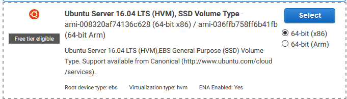
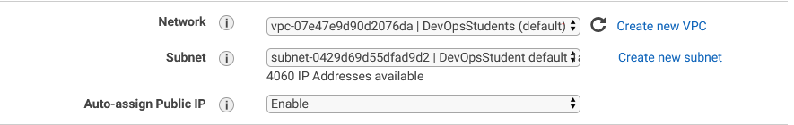
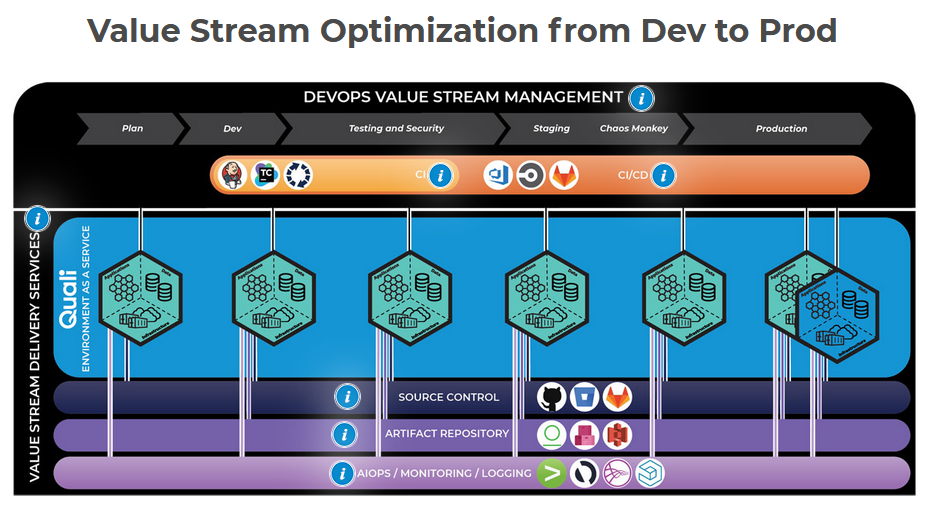
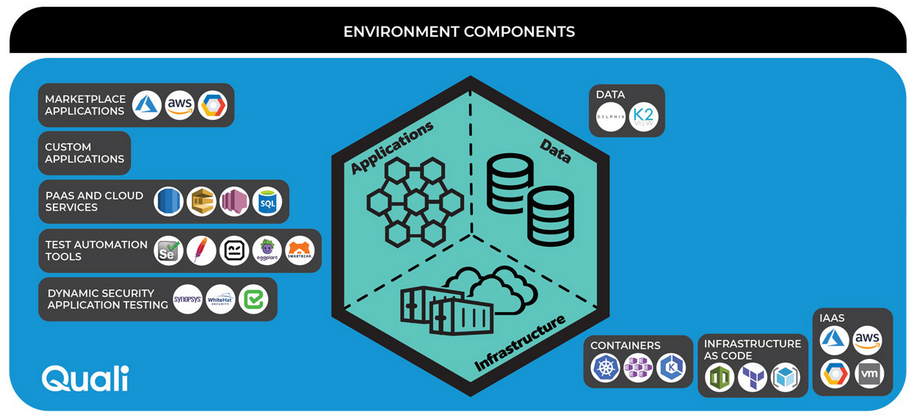

# AWS intro and Deployment

### What is AWS?

Amazon Web services or AWS is a secure cloud services platform, offering compute power, database storage, content delivery and other functionality to help businesses scale and grow.

In simple words AWS allows you to do the following things-

1. Running web and application servers in the cloud to host dynamic websites.
2. Securely store all your files on the cloud so you can access them from anywhere.
3. Using managed databases like MySQL, PostgreSQL, Oracle or SQL Server to store information.
4. Deliver static and dynamic files quickly around the world using a Content Delivery Network (CDN).
5. Send bulk email to your customers.

**Compute** | **Storage** | **Databases** | **Migration** | **Networking & Content Delivery** | **Developer Tools** | **Management Tools** | **Analytics** | **Security, Identity, and Compliance** | **Application Services** | **Mobile Services** | **Business Productivity** | **Desktop & App Streaming** | **Artificial Intelligence** | **AR & VR** | **Customer Engagement** | **Game Development** | **Internet of Things**

### Useful commands --

**Secure Copy** of folder app to a new app folder inside the VM
```bash
scp -i ~/.ssh/DevOpsStudents.pem -r app/ ubuntu@<ip_address_of_EM2>:~/app/
```

**Enter the EM2 Machine** via SSH
```bash
ssh -i ~/.ssh/DevOpsStudents.pem ubuntu@<ip address from VM>
```

**Move file/ folder** From one location to another
```bash
mv from:<path/file> target:<path/file>
```

**List** this is like **ls** and lists all items in a directory
```bash
l <show all items in current directory> [-a <hidden folders>]
```

**remove a folder** even if it is not empty
```bash
rm -rf <folder> # helps delete directory even if its not empty
```

## Steps to setting up a EC2 Machine


**AWS**

We log in through this [**LINK**](https://sparta-devops.signin.aws.amazon.com/console)


**Post Requests**

These happen behind the scenes and are usually data being sent to the server from the user, typically these are private details and they wont be visible in the URL. This is used sometimes during payment as it is confidential information that should not be seen by any other individuals.

**Get Requests**

These are requests that happen when you click a website for example you are getting all the URL requests and displaying the page. The URL usually contains paths and arguments of the get request too.

They both have an end-point when they are made, these are used in different cases but have their specific uses.

**AWS** website we went to `Services > EMC2 > Instances` then we click **Create** instance.

**Creating an instance of a Machine**


Now we are going to create an instance, of this particular machine:



Then a list of machines are loaded, some of them are very powerful, with lots of **cores** and **gigabytes** these are more expensive but are available so must be in some kind of demand.

We chose the t2.micro with **1** CPU and **1GB** of memory.

In the configuring the instance we left everything except these settings below.



Then in the Tags section we added `Name` into the key and in the value we added our own naming convention, mine was `Eng67.John.Webapp`.


Then we launched our server and navigated to our .ssh and added the DevOpsStudent.pem we were given.

Whilst in the ssh folder in git bash we need to ssh into the Virtual Machine that is now being hosted on **AWS**. To access it we used the command:

```bash
ssh -i ~/.ssh/DevOpsStudents.pem ubuntu@<ip address from VM>
```

Now we are inside this Virtual Machine on the Amazon Web Services.

Other users cannot SSH into our Virtual Machines, because when we set up the Virtual machines `security group` we set it to only allow our IP access our machine.

**Moving some code to AWS VM**

We installed the following:

```bash
sudo apt-get update

sudo apt-get install nginx

sudo apt-get install nodejs

sudo apt-get install npm
```

Now we want to send a folder into our **EC2** instance being hosted on AWS.

There is also a cool way to access a manual of certain commands when you use the `man` key word before a command, for example:

```bash
man scp <to send folders to VM on AWS>
```

To send a secure copy of our folder we are using:

```bash
scp -i <key> path/file user@ip:/path/file1
```

In the folder we can open the directory we are in using sublime with `subl .`

We used the command:

```bash
scp -i ~/.ssh/DevOpsStudents.pem -r app/ ubuntu@3.250.67.195:~/app/
```

This then copied over the app folder from within our local directory into the virtual machines directory using the pem key to following by `-r` as this makes it recursive in order to move all the files until there are no more left. The letter `i` stands for identity and should have our public key to match with the stored private key on AWS.

We did the necessary [provisioning](provision.sh) our Virtual machines to to get NGINX running and NPM installed then the web server could be reached and by adding over people to my security group they were also able to access the web server.

### What is a production Environment

A production environment is where software runs constantly and is widely available to end users and/ or software. 

A production environment in DevOps is an environment where software and other products are actually put into operation for their intended uses by end users. A production environment can be thought of as a real-time setting where programs are run and hardware setups are installed and relied on for organization or commercial daily operations.

The production environment is like the other environments used for testing and deployment, the only difference that it has is the most stable and up-to-date version of any product that has met the acceptance criteria for it to be released to the end-users. These end users will use the product and potentially provide feedback for future iterations of the software.

**Some interesting Images**




